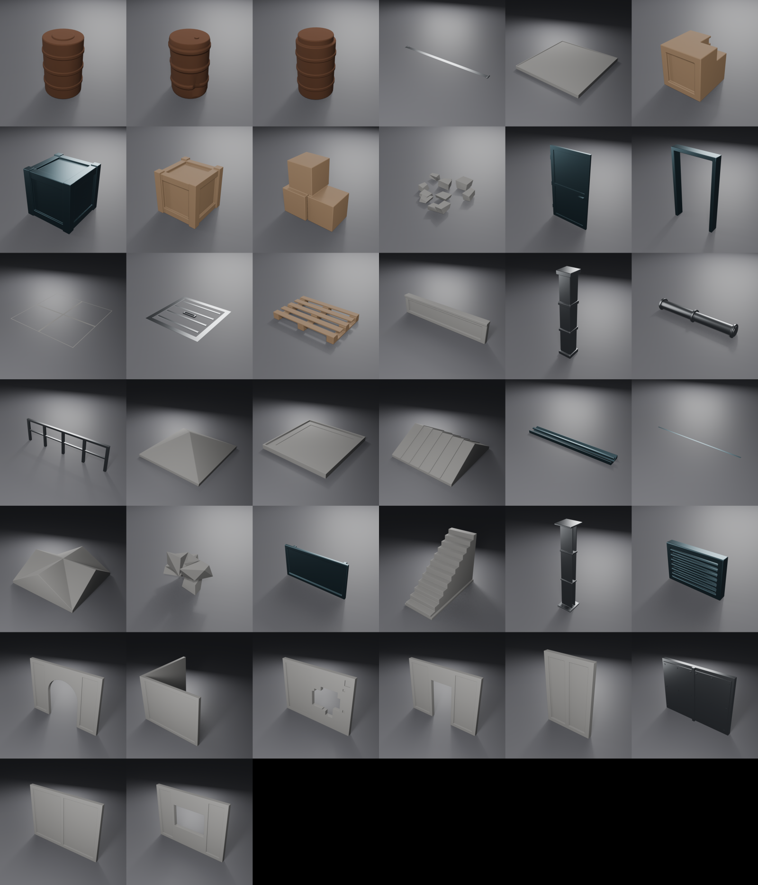
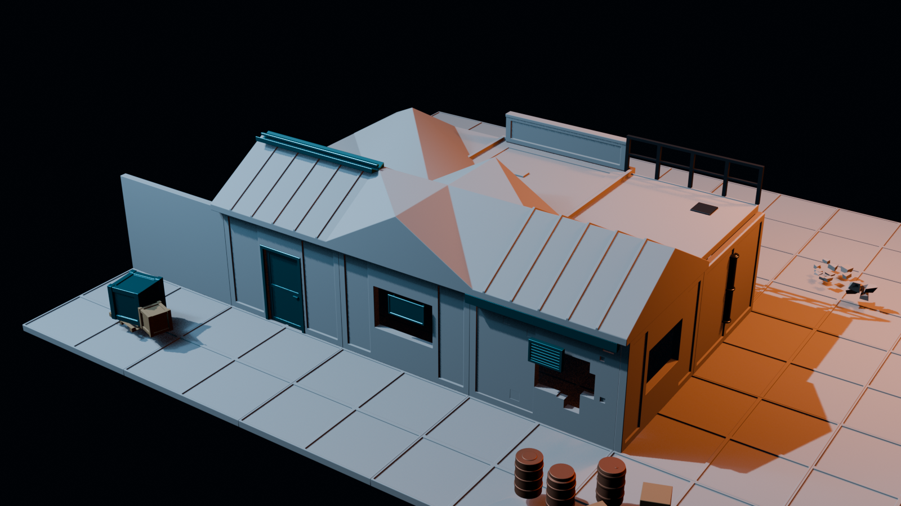
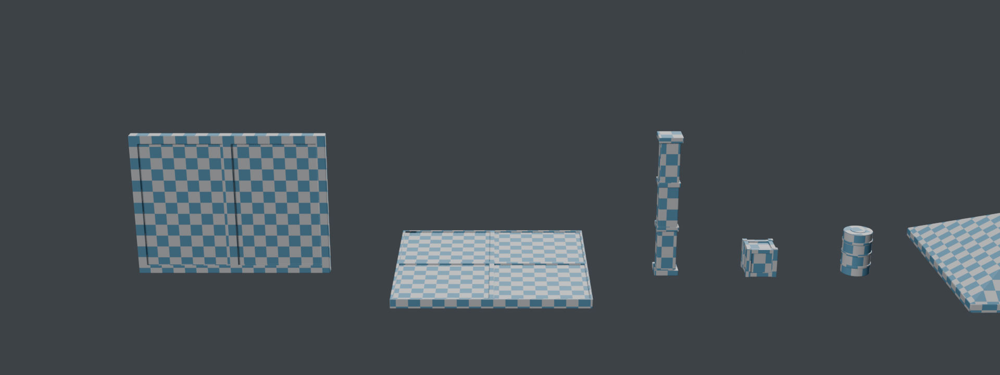

# ModKit — Modular Building Kit & Prop Pack

[](LICENSE)


A free, public-domain modular building kit and environment prop set for
Unreal Engine, Unity, three.js and Blender.

### ▶ [Try it in your browser](https://jaronkbragg7337.github.io/asset-pack-ue-threejs-blender-unity/)

### ⬇ [Download ModKit v1.2](https://github.com/JaronKBragg7337/asset-pack-ue-threejs-blender-unity/releases/latest)

Spin every piece, toggle wireframe, read the triangle count and real-world
dimensions. The complete FBX, GLB and Blender pack is one ZIP. No signup.



**Everything here is CC0.** Use it commercially, modify it, ship it, sell what
you make with it. No attribution required, no strings.

---

## What's inside

**Modular building kit (15)** — walls (straight, half, doorway, window, arch,
corner, **damaged**, **reinforced**), floor and ceiling slabs, pillar, stairs,
railing, doorframe, parapet.

**Roofs (6)** — flat panel with kerb, pitched gable with standing seams, hip
corner, cross-gable valley, ridge cap, eave fascia + gutter.

**Interior (4)** — I-beam, braced support column, door leaf sized to the
doorway wall, recessed floor hatch.

**Environment props (13)** — small/large/broken crates, pre-stacked cluster,
barrel plus open and dented variants, pallet, pipe run, wall vent, wall sign,
rubble pile, debris scatter.

38 meshes, ~40,600 triangles for the entire set. No textures required — the
shading comes from geometry, not maps (see
[How the shading works](#how-the-shading-works)).

Everything is generated by script. There are no hand-placed vertices, so the
whole pack can be re-rolled at different proportions by changing a few
constants and running one command.

## Example scene

### ▶ [Explore the Industrial Outpost in your browser](https://jaronkbragg7337.github.io/asset-pack-ue-threejs-blender-unity/docs/#example)

The Industrial Outpost is a 70-instance, pack-only diorama built from **all 38
assets**. It demonstrates the four-metre grid, corner pivots, roof junctions,
interior structure, wall details and prop placement in one editable scene.



Download the [Blender source](examples/industrial_outpost/ModKit_Industrial_Outpost.blend),
[GLB](examples/industrial_outpost/ModKit_Industrial_Outpost.glb) or
[FBX](examples/industrial_outpost/ModKit_Industrial_Outpost.fbx). The complete
transform list is also available as [`layout.json`](examples/industrial_outpost/layout.json).
Regenerate every output with:

```bash
blender -b source/ModKit.blend --python scripts/build_demo_scene.py
```


---

## Which files do I want?

| Folder | Format | Use it for |
|---|---|---|
| `exports/FBX_Nanite/` | FBX, one mesh each | **Unreal 5** (Nanite), **Unity** |
| `exports/FBX_LOD/` | FBX + LOD1–3 | Mobile, older engines, anything without Nanite |
| `exports/GLTF/` | GLB | **three.js**, Godot, web viewers |
| `source/ModKit.blend` | Blender 5.1 | Editing the originals |
| `examples/industrial_outpost/` | BLEND, GLB, FBX | Complete assembled demo scene |

All meshes are authored in metres — 1 unit = 1 m = 100 Unreal units.

---

## Quick start

### Unreal Engine 5

Drag `exports/FBX_Nanite/*.fbx` into the content browser:

| Setting | Value |
|---|---|
| Import Uniform Scale | 1.0 |
| Combine Meshes | on |
| Generate Lightmap UVs | on |
| Auto Generate Collision | on |
| Normal Import Method | Import Normals and Tangents |

Then select all → right-click → **Nanite → Enable**.

> **Import normals, don't recompute them.** The hard edges come from baked
> weighted normals. Letting Unreal recalculate will soften every bevel and the
> pack will look muddy.

Prefer to script it? See [`scripts/`](scripts/) — `ue_import.py`, `ue_lods.py`
and `ue_validate.py` handle import, LOD chains, materials and an audit pass.


### Unity

Drop `exports/FBX_Nanite/*.fbx` into `Assets/`. In the import inspector:

| Setting | Value |
|---|---|
| Convert Units | on |
| Scale Factor | 1 |
| Normals | Import |
| Generate Lightmap UVs | on (only if you bake lighting) |

Same caveat as Unreal: set **Normals → Import**, not Calculate.

Use `exports/FBX_LOD/` instead if you want the pre-built LOD meshes; Unity
imports them as separate meshes that you can wire into an `LODGroup`.

### three.js

Load the GLBs with `GLTFLoader` — they are exported Y-up, so no rotation fix
is needed:

```js
import { GLTFLoader } from 'three/addons/loaders/GLTFLoader.js';

const loader = new GLTFLoader();
loader.load('exports/GLTF/SM_Wall_Straight_4m.glb', (gltf) => {
  scene.add(gltf.scene);
});
```

Models are 4 m wide and 3 m tall in world units. The bundled materials are flat
PBR placeholders — swap in `MeshStandardMaterial` with your own maps.

### Blender

Open `source/ModKit.blend`. Every asset is laid out on a showcase grid, ready
to append into your own file.


---

## The grid

| Quantity | Metres | Unreal units |
|---|---|---|
| Module | 4 m | 400 uu |
| Wall height | 3 m | 300 uu |
| Wall thickness | 0.20 m | 20 uu |
| Floor slab | 0.20 m | 20 uu |
| Door opening | 1.20 × 2.20 m | 120 × 220 uu |
| Window opening | 1.80 × 1.20 m, sill at 1.00 m | 180 × 120 uu |

Set grid snap to **100 uu** for general work and **50 uu** for trim. Pieces line
up on 400/200/100 steps with no gaps.

### Pivots

* **Kit pieces** — origin at the **grid corner** (min X, min Y, min Z). Drop a
  wall on a grid intersection and it fills the module to its +X/+Y.
* **Floor slabs** — origin at the corner of the **top surface**, so a floor at
  `Z = 0` gives a walking surface at `Z = 0` and walls placed at `Z = 0` sit
  directly on it.
* **Props** — origin at **base centre**, so they drop onto floors without
  sinking and rotate about themselves.

---

## How the shading works

There are no normal-map bakes in this pack, and it doesn't need any. Each mesh
is built as a single watertight manifold via exact booleans, then gets:

1. a **Bevel** modifier — 1.2 cm, 2 segments, 30° angle limit, harden normals
2. a **Weighted Normal** modifier — keep sharp, weight 60
3. full smooth shading

That combination produces crisp hard edges with a highlight that rolls off
believably. It's why the pieces read as solid objects under moving light while
carrying no textures at all.

The booleans matter. Abutting loose boxes would leave interior faces and break
the bevel into disconnected fragments; unioning them into one solid keeps the
highlight edges unbroken and the triangle count honest.

Measured, not assumed: on every flat panel in the kit the angle between the
geometric face normal and the interpolated vertex normals is **0.00°**. That is
what "the shading comes from geometry" has to mean to be worth claiming.

---

## UV layout and texel density

The pack ships two UV channels.

| Channel | Name | Purpose |
| ------- | ------------ | --------------------------------------------------- |
| UV0 | `UVMap` | World-space tiling. **2.00 m of surface per repeat** |
| UV1 | `UVLightmap` | Packed, non-overlapping, inside 0–1, for lightmaps |

UV0 is deliberately **not** confined to 0–1. A 4 m wall runs to u = 2.0, which
is how tiling materials and trim sheets are meant to work, and it is what makes
one concrete material read at the same scale on a wall, a floor and a crate.

Before v1.3 every mesh was smart-projected into its own 0–1 square, so texel
density varied **8.7×** across the pack — `SM_Roof_Pitched_4m` sat at 0.074 UV
units per metre while `SM_Debris_Scatter` sat at 0.641. Any single tiling
texture appeared nearly nine times coarser on one piece than another, which is
the specific thing that stops a modular kit from reading as a kit once it is
textured. Density is now uniform to within **1.000×** across all 38 assets.

Verify it yourself — this prints a per-asset table and renders a checker:

```bash
blender -b --python scripts/check_uv_density.py
```



Every checker square is the same real-world size on all six assets. Retarget
the whole pack by changing one constant in `scripts/kit_config.py`:

```python
UV_TILE_METRES = 2.0    # metres of surface per full texture repeat
```

---

## Driving this pack with an AI agent (MCP)

Both halves of this pipeline now have first-party AI integrations. Neither is
required to use the pack — but if you're extending it, they remove most of the
scripting boilerplate.

### Unreal Engine 5.8+ — official MCP server

Epic shipped an experimental MCP server **inside the editor process** in UE 5.8
(June 2026). The plugin's identifier is `ModelContextProtocol`; it surfaces as
**Unreal MCP** in the Plugin Browser.

The `ModKitDemo` project in this repo's sibling setup ships with it pre-enabled.
For your own project:

1. **Edit > Plugins**, search **Unreal MCP**, enable it. (It pulls in **Toolset
   Registry** automatically.) Restart the editor.
2. **Edit > Editor Preferences > General > Model Context Protocol** → tick
   **Auto Start Server**. It binds to `http://127.0.0.1:8000/mcp`.
3. Generate a client config from the editor console:
   ```
   ModelContextProtocol.GenerateClientConfig ClaudeCode
   ```
   Supported clients: `ClaudeCode`, `Cursor`, `VSCode`, `Gemini`, `Codex`, `All`.
   This writes `.mcp.json` to the project root.
4. Launch your agent **from the project root** so it finds `.mcp.json`.

Verify it's actually serving:

```bash
python scripts/check_unreal_mcp.py
```

> Run that from a **normal terminal**, not Unreal's Python console. Unreal ticks
> the MCP server on the game thread, so a request issued from inside the editor
> process deadlocks against itself. This cost me a confusing timeout — hence the
> standalone script.

**Caveats, straight from Epic:** it's Experimental, loopback-only, and has **no
authentication layer** — don't expose it beyond your machine. Tool calls run
serially on the game thread, so clients must not issue overlapping calls.

### Blender — official Anthropic connector

Anthropic and the Blender Foundation shipped an official Blender connector in
April 2026 (Anthropic also funded Blender's Python API work). It needs Blender
4.2+ and is enabled through **Claude's connector settings**, not installed from
this repo.

Because it's built on MCP, it works with other MCP-capable clients too — not
just Claude.

### Which to use for what

| Task | Best route |
|---|---|
| Generating/altering the meshes | `scripts/build_kit.py` (deterministic, reproducible) |
| Exploring or debugging a scene | Blender connector |
| Importing, LODs, materials | `scripts/ue_*.py` (headless, no editor needed) |
| Level layout, lighting, iterating in-editor | Unreal MCP |

The scripts remain the reproducible path — an agent is great for exploration,
but `build_kit.py` regenerates this pack byte-for-byte every time.

---

## Re-rolling the pack

Every tunable lives in **`scripts/kit_config.py`** — nothing else in the
codebase contains a hard-coded dimension:

```python
MODULE         = 4.0    # module size
WALL_HEIGHT    = 3.0
WALL_THICKNESS = 0.20
BEVEL_WIDTH    = 0.012  # the single biggest lever on how the pack reads
```

There are also presets — `chunky`, `fine`, `compact` — and a `validate()` pass
that refuses to build impossible combinations (a door taller than the wall, a
bevel wider than the trim it sits on) rather than emitting broken geometry.

```bash
python scripts/test_config.py     # checks every preset, no Blender needed
```

Change the constants and rebuild (Blender 5.x on your PATH):

```bash
blender -b --factory-startup --python scripts/build_kit.py
blender -b source/ModKit.blend   --python scripts/render_previews.py
blender -b --factory-startup --python scripts/make_sheet.py
```

`build_kit.py` writes all three export formats, saves the .blend and refreshes
`docs/asset_manifest.csv`.

To add a piece, write a function returning `L.finish(bm, name, ...)` and add it
to `define_assets()`. The library gives you `add_box`, `add_cylinder`, `carve`,
`weld`, `carve_cylinder`, `jitter` and `recess_faces` to build with.

---

## Known quirks

* **Unreal ignores Blender's `LOD_` grouping null.** Importing `FBX_LOD/`
  directly yields four separate meshes rather than one LOD chain.
  `scripts/ue_lods.py` works around this by assigning Unreal's built-in LOD
  groups, which generates the chain in-engine — and Unreal's reducer gives
  cleaner silhouettes than Blender's decimate anyway.
* **`StaticMeshEditorSubsystem` is `None` inside a commandlet**, and the
  deprecated `EditorStaticMeshLibrary.set_lods` returns `-1` there. Both dead
  ends are documented in the script headers so you don't rediscover them.
* **The UV-channel column in `docs/ue_validation.txt` reads `0`.** That's a
  commandlet artifact — render data isn't built in that context. Lightmap UVs
  are generated correctly at import.


---

## Repo layout

```
.
├── source/ModKit.blend           every asset on a showcase grid
├── AGENTS.md                     conventions for AI coding agents
├── CONTRIBUTING.md               conventions for humans
├── scripts/
│   ├── kit_config.py             ALL tunables + presets + validation
│   ├── test_config.py            config sanity checks (no Blender needed)
│   ├── modkit_lib.py             geometry + export helpers
│   ├── build_kit.py              asset definitions -- run this to rebuild
│   ├── render_previews.py        per-asset studio renders
│   ├── make_sheet.py             composites the contact sheet
│   ├── ue_import.py              Unreal import + materials
│   ├── ue_lods.py                Unreal LOD chain assembly
│   ├── ue_validate.py            Unreal-side audit
│   └── check_unreal_mcp.py       verifies UE 5.8's MCP server is live
├── exports/
│   ├── FBX_Nanite/               38 single-mesh FBX
│   ├── FBX_LOD/                  38 LOD-chain FBX
│   └── GLTF/                     38 GLB
├── previews/                     38 renders + contact sheets
└── docs/
    ├── asset_manifest.csv        tri and vert counts
    └── ue_validation.txt         audit report
```

## Verification

`docs/ue_validation.txt` is a real audit of the imported pack, not a claim:
all 38 meshes have Nanite enabled in the Nanite set, all 38 have a 4-level LOD
chain with non-increasing triangle counts in the LOD set, zero problems
reported.

## Contributing

Issues and PRs welcome — especially new kit pieces that respect the 4 m grid.
Since the whole pack is procedural, a new asset is a single function plus one
line in `define_assets()`.

* Humans: [`CONTRIBUTING.md`](CONTRIBUTING.md)
* AI agents (Codex, Claude Code, Cursor): [`AGENTS.md`](AGENTS.md)

Wanted most: more wall variants, small example scenes per engine, richer
materials, stair variants, and a command-line preset selector.

## License

[CC0 1.0 Universal](LICENSE) — public domain dedication. Meshes, scripts,
renders, all of it. Do whatever you like.
